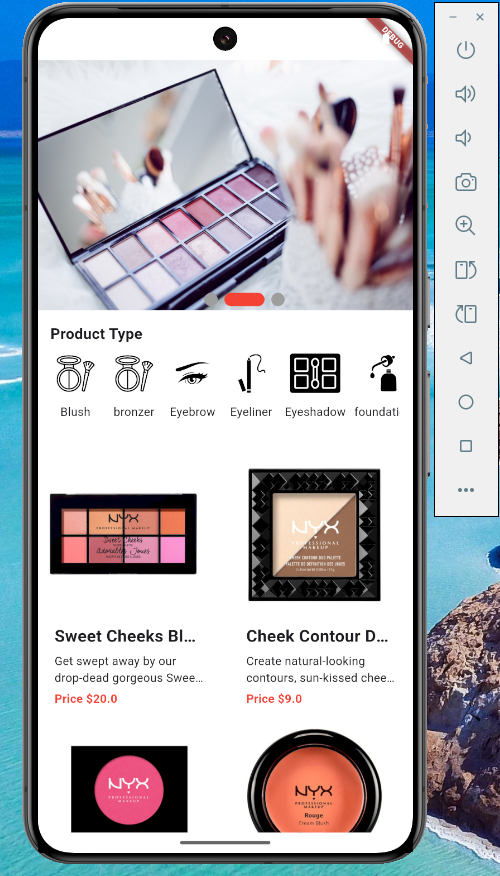
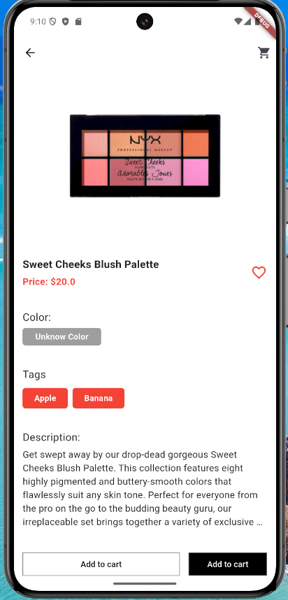
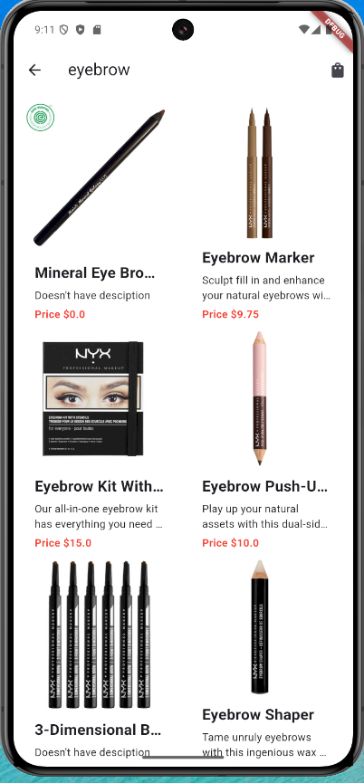
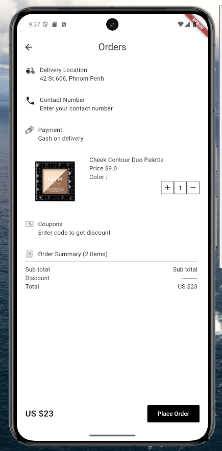

# Custom Scroll View

A new Flutter project.

## Getting Started
 - Run Flutter pub get

### HomeScreen 
 

### Product Detail Screen 
 

### Product Category View 
 

### Product Order Screen
 

For help getting started with Flutter development, view the
[online documentation](https://docs.flutter.dev/), which offers tutorials,
samples, guidance on mobile development, and a full API reference.
